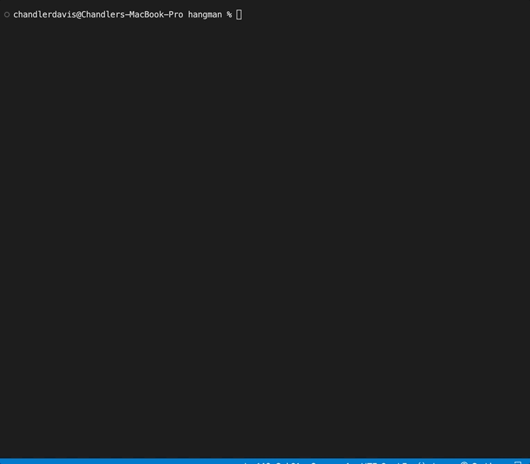

# Hangman

**What does this application do and why?**

* Plays a game of hangman with the user
* Explores how to navigate arrays and functions in java using user input 

**How the application is organized**
Hangman is organized in the following files:

**Step-by-Step on how to run the application**
* Open the terminal
* type "java hangman" to begin
* Press any key to start the game
* Guess individual characters 
* If the character is in the generated word, it will fill in the blank
* If the character is not in the generated word, it will be added to the misses, and a portion of the hangman will show on the board
* The user wins if they can guess the word before the drawing of the hangman is complete
* If the user guesses incorrectly 6 times, the drawing of the hangman is completed and they lose.

**What the application looks like**

**Link to Github Repository**

GitHub Repository: https://github.com/echandlerdavis/hangman-java

**Technologies Used** 

* Java!
* Classes
* Functions
* Arrays
* For and While Loops